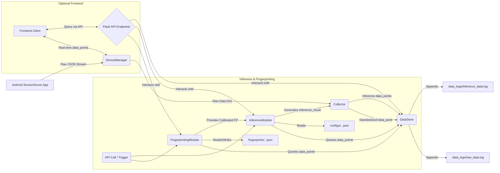

# Sensor Data Processing and Inference Engine

This project provides a Python-based backend system designed to collect, store, process, and analyze sensor data streamed from sources like the original Android `SensorServer` application. It transforms the raw sensor stream into structured, persistent data and enables advanced operations like location fingerprinting and activity inference.

Think of it as an **intelligent layer** built on top of the basic sensor streaming provided by the Android app.

## Purpose and Use Cases

While the Android `SensorServer` app excels at broadcasting raw sensor values, this Python engine unlocks more sophisticated analysis and state detection:

*   **Context-Aware Location:** Instead of relying solely on GPS (which is often inaccurate indoors), you can use Wi-Fi scans, Bluetooth signals, and pressure sensor readings to create detailed "fingerprints" of specific locations (e.g., "Kitchen", "Office Desk", "Basement"). The inference engine can then compare live sensor data to these fingerprints to determine the device's location with higher confidence, even indoors.
*   **Activity Recognition:** By analyzing patterns in accelerometer, gyroscope, and potentially other sensors over time, you could build inference configurations to detect states like "Stationary", "Walking", "In Vehicle", etc.
*   **Environmental Monitoring:** Log and analyze trends in pressure, temperature (if available), or ambient light over long periods.
*   **Complex Event Detection:** Combine multiple sensor types and inference results to trigger actions based on complex conditions (e.g., "Device is stationary *and* in the 'Office' location *and* pressure has dropped significantly").
*   **Data Logging and Analysis:** Provides a persistent, queryable log of all sensor data and inference results, enabling offline analysis, model training, and debugging.
*   **Second-Order Inference:** Use the *output* of one inference as an *input* to another. For example:
    *   **Detailed Movement Patterns:** Combine the `inference.location.confidence` and `inference.location.prediction` data points with raw IMU data (accelerometer, gyroscope) to train and run a *second* inference configuration. This could detect more nuanced movements like "Walking from Office to Living Room" or specific, location-dependent activities like "Using the Basement Bathroom".
    *   **How it Works:** The first inference (e.g., `location`) logs its results. A second inference configuration (e.g., `detailed_movement`) lists both the raw IMU sensor types *and* the first inference's output types (like `inference.location.confidence`) in its `data_point_types`. Fingerprints for this second configuration (e.g., `detailed_movement.office_to_livingroom`) are calibrated using periods where that specific movement occurred, capturing patterns across *all* its input types (IMU + location confidence). Running the `detailed_movement` inference then compares current IMU *and* location confidence data against these complex fingerprints.

## Understanding the Output: Data Structures

This system works with standardized data structures defined in `tasks/contract.yml`.

**1. `data_point` (The Foundational Unit):**

   Every piece of sensor data or inference output is stored as a `data_point` in the log files (`data_logs/*.log`).

   ```
   +---------------------+-----------------------------------------+
   | Field               | Example Value                           |
   +---------------------+-----------------------------------------+
   | created_at (str)    | "2023-10-27T10:00:05.123Z"              |
   | type (str)          | "android.sensor.pressure"               |
   |                     | "android.sensor.wifi_scan.rssi"         |
   |                     | "inference.location.prediction"       |
   | key (str | null)   | null                                    |
   |                     | "aa:bb:cc:dd:ee:ff" (MAC address)     |
   |                     | "location_inference_v1" (Config Name) |
   | value (any)         | 1013.25                                 |
   |                     | -65                                     |
   |                     | "kitchen"                               |
   +---------------------+-----------------------------------------+
   ```

**2. `fingerprint` (Statistical Summary):**

   Generated by the `FingerprintingModule`, often representing a "calibrated" state (e.g., the typical sensor readings in the "Kitchen"). Stored in `fingerprints/calibrated_fingerprints.json`.

   ```
   +---------------------+---------------------------------------------------+
   | Field               | Example Value                                     |
   +---------------------+---------------------------------------------------+
   | type (str)          | "location.kitchen"                                |
   | created_at (str)    | "2023-10-27T11:30:00Z"                            |
   | updated_at (str)    | "2023-10-27T11:35:10Z"                            |
   | inference_ref (str) | "location_inference_v1"                           |
   | raw_data_ref (str)  | (Compressed Hex representation of source data_points) |
   | statistics (dict)   | {                                                 |
   |                     |   "android.sensor.pressure": {                   |
   |                     |     "median_value": 1014.5,                      |
   |                     |     "std_dev_value": 0.2,                       |
   |                     |     "num_samples": 120                          |
   |                     |   },                                              |
   |                     |   "android.sensor.wifi_scan.rssi.aa:bb:cc:dd:ee:ff": { |
   |                     |     "median_value": -55.0,                      |
   |                     |     "std_dev_value": 3.5,                       |
   |                     |     "num_samples": 65                           |
   |                     |   }, ... (more paths)                             |
   |                     | }                                                 |
   +---------------------+---------------------------------------------------+
   ```

**3. `inference_result` (Output of an Inference Run):**

   Generated by the `InferenceModule` after comparing current data to calibrated fingerprints. Logged as a `data_point` with `type = "inference.{type}.result"` in `inference_data.log`.

   ```
   +-------------------------+--------------------------------------+
   | Field                   | Example Value                        |
   +-------------------------+--------------------------------------+
   | inference_name (str)    | "location_inference_v1"              |
   | created_at (str)        | "2023-10-27T12:05:15Z"              |
   | overall_prediction(dict)| {                                    |
   |                         |   "value": "kitchen",               |
   |                         |   "confidence": 0.92                |
   |                         | }                                    |
   | comparisons (list)      | [                                    |
   |                         |   {                                  |
   |                         |     "target_type": "location.kitchen", |
   |                         |     "target_id": "kitchen",          |
   |                         |     "total_score": 15.3, (Lower is better? Depends on algo) |
   |                         |     "confidence_score": 0.92,         |
   |                         |     "path_contributions": { ... }    |
   |                         |   },                                 |
   |                         |   {                                  |
   |                         |     "target_type": "location.office",|
   |                         |     "target_id": "office",           |
   |                         |     "total_score": 88.1,            |
   |                         |     "confidence_score": 0.15,         |
   |                         |     "path_contributions": { ... }    |
   |                         |   }, ... (more comparisons)         |
   |                         | ]                                    |
   +-------------------------+--------------------------------------+
   ```

**4. `fingerprint` (Second-Order Example):**

   This fingerprint could be used for a "Detailed Movement" inference. Notice it includes statistics for raw sensors *and* the output of a previous "Location" inference.

   ```
   +---------------------+---------------------------------------------------+
   | Field               | Example Value                                     |
   +---------------------+---------------------------------------------------+
   | type (str)          | "detailed_movement.office_to_livingroom"          |
   | created_at (str)    | "2023-10-27T14:00:00Z"                            |
   | updated_at (str)    | "2023-10-27T14:05:00Z"                            |
   | inference_ref (str) | "movement_inference_v2"                           |
   | raw_data_ref (str)  | (Compressed Hex representation of source data_points) |
   | statistics (dict)   | {                                                 |
   |                     |   "android.sensor.accelerometer.x": {            |
   |                     |     "median_value": 0.1,                         |
   |                     |     "std_dev_value": 1.5,                         |
   |                     |     "num_samples": 300                          |
   |                     |   },                                              |
   |                     |   "android.sensor.gyroscope.z": {                |
   |                     |     "median_value": -0.05,                       |
   |                     |     "std_dev_value": 0.8,                         |
   |                     |     "num_samples": 300                          |
   |                     |   },                                              |
   |                     |   "inference.location.confidence": {             |
   |                     |     "median_value": 0.85,                        |
   |                     |     "std_dev_value": 0.1,                         |
   |                     |     "num_samples": 30  # Fewer samples likely      |
   |                     |   },                                              |
   |                     |   "inference.location.prediction": {             |
   |                     |     "#samples_office": 15, # Non-numeric stats   |
   |                     |     "#samples_livingroom": 15                    |
   |                     |   }, ... (more sensor/inference paths)            |
   |                     | }                                                 |
   +---------------------+---------------------------------------------------+
   ```

## Core Architectural Changes

The original `SensorServer` functioned as a WebSocket server hosted directly on an Android device. This version implements a standalone Python server with the following key differences:

1.  **Server-Side Logic:** The primary processing, storage, and inference logic now resides in this Python backend, not on the device.
2.  **Modular Design:** The system is broken down into distinct components:
    *   `DeviceManager`: Interacts with the sensor source (e.g., the original SensorServer Android app or another compatible device client) to fetch raw data. It also hosts WebSocket endpoints for potential frontend real-time communication.
    *   `Collector`: Receives raw data, standardizes it into a `data_point` format, and passes it to the `DataStore`. It also handles formatting and logging inference results.
    *   `DataStore`: Persists all standardized `data_point` objects (raw sensor readings, inference results) into time-series log files (`data_logs/raw_data.log`, `data_logs/inference_data.log`).
    *   `FingerprintingModule`: Generates statistical summaries (`fingerprints`) from sensor data over time windows based on inference configurations. Manages calibrated fingerprints stored in `fingerprints/calibrated_fingerprints.json`.
    *   `InferenceModule`: Executes configurable inference logic based on comparing current data/fingerprints against calibrated fingerprints. Manages inference configurations stored in `configs/inference_configurations.json`.
3.  **Data Standardization:** All sensor readings and inference outputs are converted to a consistent `data_point` format before storage (see diagram above).
4.  **Persistent Storage:** Sensor data and inference results are logged to disk, allowing for historical analysis and retrieval, unlike the purely streaming nature of the original app.
5.  **Fingerprinting & Inference:** Introduces advanced capabilities for creating statistical fingerprints and running inference comparisons (see Purpose section and diagrams).
6.  **Configuration:** Manages system behavior through JSON configuration files for inference logic (`inference_configurations.json`) and calibrated fingerprints (`calibrated_fingerprints.json`).
7.  **API Control:** Provides a Flask-based HTTP API for interacting with the system (fetching data, managing fingerprints, managing inference configurations, triggering inference runs).

## Data Flow Visualization



*(Simplified view; actual interactions via method calls between Python modules)*

## Key API Endpoints (Flask)

*   `GET /api/data`: Retrieve `data_point` objects from `DataStore` with filters for time window, types, keys, and files.
*   `GET /api/fingerprints`: Fetch all calibrated fingerprints.
*   `POST /api/fingerprints/generate`: Generate a fingerprint for a given type, inference config, and end time.
*   `POST /api/fingerprints/calibrate`: Save or update a calibrated fingerprint.
*   `GET /api/inference_configs`: Fetch all inference configurations.
*   `POST /api/inference_configs`: Save a new inference configuration.
*   `PUT /api/inference_configs/<config_name>`: Update an existing inference configuration.
*   `POST /api/inference/run/<config_name>`: Trigger an inference run for a specific configuration.

*(Refer to `server/main.py` for detailed parameters and implementation)*

## Setup and Running

1.  **Prerequisites:**
    *   Python 3.x
    *   Install dependencies: `pip install Flask websockets aiohttp` (add other dependencies as needed).
    *   An active sensor source (like the original SensorServer Android app running on a device on the same network).

2.  **Configuration:**
    *   Modify constants in `server/main.py` if needed (e.g., `DEVICE_MANAGER_LISTEN_HOST` should be the IP address of the machine running this Python server, accessible by the Android app). Ensure ports don't conflict.
    *   Create initial (empty or pre-configured) JSON files if desired:
        *   `configs/inference_configurations.json`
        *   `fingerprints/calibrated_fingerprints.json`

3.  **Run the Server:**
    ```bash
    python server/main.py
    ```
    This will start:
    *   The `DeviceManager` attempting to connect to the configured device WebSocket.
    *   The `DeviceManager`'s own HTTP/WebSocket servers for device/frontend communication.
    *   The Flask web server providing the API and potentially web pages.

4.  **Interaction:**
    *   Ensure the Android app (or other sensor source) is configured to send data to the Python server's IP address and port (`DEVICE_MANAGER_LISTEN_HOST`, `DEVICE_MANAGER_LISTEN_WS_PORT`).
    *   Interact with the system via the Flask API endpoints (e.g., using `curl`, Postman, or a custom frontend).
    *   Check log files (`main_app.log`, `data_logs/*.log`) for activity and stored data.


